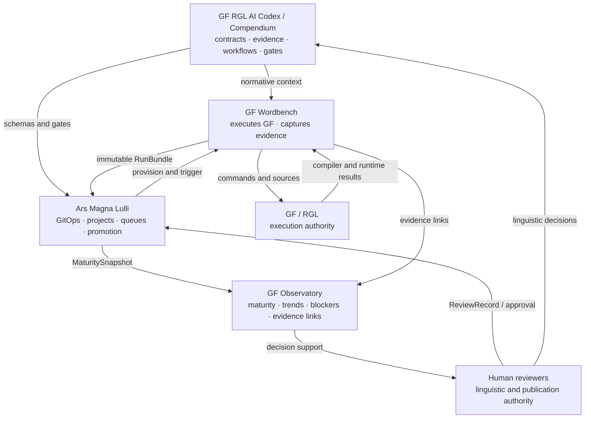

# Total Alignment of the Four-System GF Ecosystem

> **Core rule:** GF remains the execution authority. The four systems surround GF without reproducing it: **Codex governs the reasoning, Wordbench produces the evidence, Lulli orchestrates the work, and Observatory explains the state.** Human reviewers remain the authority for linguistic acceptance and publication decisions.

## Document status

This document defines the target alignment and orchestration contract for four systems:

1. **GF RGL AI Codex / Compendium**
2. **GF Wordbench**
3. **Ars Magna Lulli**
4. **GF Observatory**

It is an architecture and governance specification. It does **not** certify that the current implementations are complete, executable, linguistically validated, release-ready, or accepted upstream.

### Normative language

The terms **MUST**, **MUST NOT**, **SHOULD**, **SHOULD NOT**, and **MAY** are normative.

- **MUST / MUST NOT**: required for alignment.
- **SHOULD / SHOULD NOT**: strongly recommended; deviations require written justification.
- **MAY**: optional.

## Source basis

- **[S1] Ars Magna Lulli README** — GitOps monorepo, multi-language orchestration, Wordbench interface, Observatory dashboard, aggregated JSON state.
- **[S2] GF Wordbench reference document** — validation pipeline, modes, evidence, diagnostics, scenarios, golds, PGF, release gates.
- **[S3] Codex–Wordbench–ChatGPT integration report** — separation of responsibilities, controlled repair loop, retesting, human-in-the-loop operation.
- **[S4] GF RGL AI Compendium README** — RGL contracts, provenance, workflows, maturity states, testing requirements, upstream preparation.

---

## Table of contents

1. [Executive summary](#1-executive-summary)
2. [The natural GF/RGL frame](#2-the-natural-gfrgl-frame)
3. [The four-system architecture](#3-the-four-system-architecture)
4. [Authority and non-overlap](#4-authority-and-non-overlap)
5. [Canonical end-to-end orchestration](#5-canonical-end-to-end-orchestration)
6. [Shared data contracts](#6-shared-data-contracts)
7. [Unified maturity model](#7-unified-maturity-model)
8. [Wordbench mode alignment](#8-wordbench-mode-alignment)
9. [Lulli as the multi-language control plane](#9-lulli-as-the-multi-language-control-plane)
10. [Observatory as the reading model](#10-observatory-as-the-reading-model)
11. [Codex / Compendium as the normative layer](#11-codex--compendium-as-the-normative-layer)
12. [Governance, provenance, and anti-drift controls](#12-governance-provenance-and-anti-drift-controls)
13. [Failure and uncertainty semantics](#13-failure-and-uncertainty-semantics)
14. [Release and upstream readiness](#14-release-and-upstream-readiness)
15. [Implementation roadmap](#15-implementation-roadmap)
16. [System acceptance criteria](#16-system-acceptance-criteria)
17. [Albanian pilot](#17-albanian-pilot)
18. [Alignment decisions](#18-alignment-decisions)
19. [Glossary](#19-glossary)

---

# 1. Executive summary

The ecosystem is built around an external center of authority: **GF and the locked RGL source version**. The four systems have distinct, non-competing responsibilities.

| System | Canonical function | Primary output | Primary prohibition |
|---|---|---|---|
| **Codex / Compendium** | Govern reasoning and RGL engineering | Contracts, evidence rules, workflows, gates, maturity states | Claim execution success without GF evidence |
| **Wordbench** | Execute and prove one language project | Run bundles, diagnostics, scenarios, gold comparisons, PGF, gate verdicts | Modify sources or declare linguistic truth |
| **Lulli** | Orchestrate projects, contributors, repositories, and pipelines | Provisioning, GitOps, queues, immutable indexing, promotion workflow | Silently reinterpret validation verdicts |
| **Observatory** | Make global state understandable | Maturity profiles, trends, blockers, evidence links | Reduce a language to an opaque single score |

## 1.1 Architecture formula

```text
GF / RGL                 = execution and structural authority
Codex / Compendium       = normative reasoning authority
Wordbench                = project evidence authority
Lulli                    = multi-project orchestration authority
Observatory              = aggregate reading authority
Human reviewers          = linguistic and publication authority
```

## 1.2 Intended outcome

The aligned ecosystem enables the following:

- A language can advance incrementally without losing the provenance of its decisions.
- Every source change can be executed in GF, diagnosed, corrected, and retested against the exact source state.
- Hundreds of languages can be coordinated without mixing their mutable state or evidence.
- Maturity can be compared without conflating morphology, syntax, parsing, regression, human review, release quality, and upstream readiness.
- Every maturity claim is explainable, versioned, evidence-linked, and revocable.

## 1.3 Success definition

The four systems are aligned when the path from a linguistic decision to GF evidence and then to a global maturity view preserves:

- source identity;
- toolchain identity;
- evidence lineage;
- uncertainty;
- subsystem boundaries;
- human responsibility.

---

# 2. The natural GF/RGL frame

The ecosystem MUST follow GF’s existing structure rather than inventing a competing metamodel. Central identifiers, workflows, tests, and reports MUST remain recognizable to GF developers.

## 2.1 GF remains the technical authority

GF decides:

- typing;
- module resolution;
- compilation;
- parsing;
- linearization;
- generation;
- morphology;
- PGF construction.

Therefore:

- Static scans and heuristics MUST NOT replace GF results.
- An AI-generated patch remains a proposal until Wordbench retests the exact applied state.
- A gold file represents a reviewed project expectation, not universal linguistic truth.
- Observatory MUST NOT display a successful GF result unless it can link to the corresponding run evidence.

## 2.2 The language is a layered system

| GF/RGL layer | Object being tracked | Required evidence | Primary system |
|---|---|---|---|
| Source lock and signatures | GF/RGL version, abstract categories, API | Commit, hash, exact signature | Codex + Lulli |
| Language architecture | `Cat`, `lincat`, records, resources, inheritance | Decisions, linguistic evidence, category contracts | Codex |
| Morphology and paradigms | Forms, inflection classes, irregulars, lexical constructors | Tables, form tests, local compilation | Wordbench |
| Concrete syntax | `Noun`, `Verb`, `Sentence`, `Question`, `Relative`, and related modules | Compilation, scenarios, feature interactions | Wordbench |
| Extensions and limits | `Extend`, `Extra`, `Symbolic`, explicit `Missing` coverage | Coverage records, tests, status ledger | Codex + Wordbench |
| Entrypoints and PGF | `SyntaxX`, `GrammarX`, final compiled artifact | Load test, PGF build, integrity manifest | Wordbench |
| Publication and upstream | Reviewable and maintainable contribution package | Reviews, rollback, provenance, release decision | Lulli + Observatory |

## 2.3 Natural evidence cycle

```text
linguistic evidence
  → selected architecture
  → category contracts
  → implementation plan
  → minimal source change
  → GF compiler evidence
  → morphology and syntax tests
  → reconciled documentation
  → maturity decision
```

This follows the Compendium principle that code is not the first durable artifact. The decision boundary and required evidence SHOULD be defined before implementation.

## 2.4 GF-native identity rule

Every central record MUST use GF-native or GF-adjacent identifiers wherever possible:

- language code;
- module path and module name;
- abstract function;
- category;
- entrypoint;
- checkpoint;
- scenario;
- PGF artifact;
- GF version;
- RGL revision;
- producer–consumer relationship.

The ecosystem MUST NOT hide these objects behind unrelated proprietary identifiers.

---

# 3. The four-system architecture



## 3.1 GF RGL AI Codex / Compendium

**Role:** provide versioned expert context describing what the RGL requires, where each responsibility belongs, which evidence is admissible, and which gate must be satisfied next.

It MUST contain or reference:

- exact abstract signatures;
- category and module contracts;
- producer–consumer maps;
- inheritance and functor structure;
- `lincat` and representation constraints;
- architecture-aware engineering patterns;
- creation, extension, repair, testing, and upstream workflows;
- evidence classifications;
- maturity states and release gates;
- patch and review protocols.

It MUST NOT:

- compile the language;
- claim successful execution without GF evidence;
- automatically modify the source repository;
- substitute for linguistic review;
- treat a model language as authoritative merely because it is related genealogically.

## 3.2 GF Wordbench

**Role:** transform an exact source state into a reproducible validation dossier by asking GF to execute the required checks and preserving evidence before interpretation.

A Wordbench instance or run context SHOULD correspond to one active language project.

Wordbench MUST:

- support `quick`, `checkpoint`, `diagnostic`, and `release` modes;
- record commands, environment, working directory, timeouts, exit codes, durations, stdout, and stderr;
- preserve raw outputs before normalization;
- execute bounded `.gfs` scenarios;
- compare normalized behavior against reviewed golds;
- build and verify PGF when required;
- distinguish direct failures, downstream failures, ambiguity, tool failures, and regressions;
- produce machine-readable and human-readable evidence packages.

Wordbench MUST NOT:

- edit GF source files;
- invent a linguistic correction;
- convert a heuristic into a GF verdict;
- silently update golds;
- mark an applied patch as validated without retesting it.

## 3.3 Ars Magna Lulli

**Role:** operate as the multi-language control plane. Lulli coordinates repositories, contributors, pipelines, state transitions, and immutable evidence indexing without becoming the linguistic validator.

Lulli MUST:

- provision or select a language project and isolated Wordbench context;
- bind each action to Git identity, repository, branch, and commit;
- lock the GF/RGL toolchain used for a run;
- trigger Wordbench through CI or dedicated execution infrastructure;
- store immutable RunBundles;
- manage queues, retries, permissions, branches, and promotion policies;
- generate or publish MaturitySnapshots from validated inputs;
- enforce release workflow and required approvals.

Lulli MUST NOT:

- rewrite Wordbench results;
- transform infrastructure failure into linguistic failure;
- infer human linguistic approval from a green build;
- merge mutable state between language tenants.

## 3.4 GF Observatory

**Role:** present language health, maturity, trends, blockers, and evidence through aggregate snapshots. Observatory is a reading and decision-support model, not a primary source of truth.

Observatory MUST:

- display the last fully satisfied development gate;
- display a multidimensional maturity profile;
- separate coverage, pass rate, confidence, and freshness;
- expose blockers and the next required workflow;
- allow every displayed result to trace back to its run, commit, test, gold, decision, or human review;
- expose stale and incompatible evidence;
- distinguish current state from historical state.

Observatory MUST NOT:

- reduce maturity to an unexplained single score;
- silently recalculate a Wordbench gate verdict;
- present a generated summary as stronger than its evidence;
- conceal missing validation behind aggregate percentages.

---

# 4. Authority and non-overlap

## 4.1 Authority order

When sources conflict, the following order applies:

1. **Locked RGL abstract signatures and canonical sources** — exact obligation and reference structure.
2. **GF results and reproducible tests** — observed compilation and behavior.
3. **Current target-language source** — implementation actually present.
4. **Accepted decisions and target-language linguistic evidence** — justified design and linguistic scope.
5. **Codex guidance and generated patterns** — interpretation and comparative engineering guidance.
6. **Observatory projection** — summary of the preceding authorities.

No generated Codex artifact or Observatory view may outrank exact source or compiler evidence.

## 4.2 Responsibility matrix

Legend: **A** = accountable, **R** = responsible, **C** = consulted, **I** = informed.

| Activity | Codex | Wordbench | Lulli | Observatory |
|---|---:|---:|---:|---:|
| Define RGL contract semantics | A/R | C | I | I |
| Select language, repository, and commit | C | C | A/R | I |
| Execute GF | I | A/R | C | I |
| Produce run evidence | I | A/R | C | I |
| Classify execution failure | C | A/R | I | I |
| Interpret the affected RGL contract | A/R | C | I | I |
| Propose a correction | C | I | I | I |
| Apply a correction | I | I | A/R through human + Git | I |
| Decide internal release | C | R for evidence | A for governance | I |
| Display maturity | C | C | C | A/R |
| Define aggregation semantics | A | C | R technically | C |

## 4.3 Semantic ownership rule

- Codex owns the **meaning** of contracts, gates, maturity axes, and evidence classes.
- Lulli MAY publish shared technical schemas implementing those semantics.
- Wordbench emits conforming execution records.
- Observatory consumes the records without changing their meaning.

---

# 5. Canonical end-to-end orchestration

## 5.1 Main workflow

| Step | Responsibility |
|---|---|
| **1. Identify** | Lulli fixes the language, repository, branch, commit, GF/RGL version, and run policy. |
| **2. Route** | Codex selects the relevant workflow, contracts, evidence, patterns, and required tests. |
| **3. Modify** | A contributor or agent prepares a minimal patch with explicit assumptions and a PatchEnvelope. |
| **4. Execute** | Wordbench runs GF in the appropriate mode and preserves raw evidence. |
| **5. Classify** | Wordbench separates direct cause, downstream effects, ambiguity, tool failure, and regression. |
| **6. Interpret** | Codex and the diagnostic agent connect the result to the exact RGL obligation and identify the next action. |
| **7. Apply** | The human and Git workflow apply the candidate patch. No success is claimed. |
| **8. Retest** | Wordbench retests the exact applied state and reports `improved`, `unchanged`, `regressed`, or `passed`. |
| **9. Promote** | Lulli applies branch, checkpoint, release, or upstream gates. |
| **10. Observe** | Observatory publishes the new snapshot, limitations, blockers, and evidence links. |

## 5.2 Correction states

```text
proposed → applied → validated
```

- **proposed**: a candidate patch exists.
- **applied**: the repository contains that candidate state.
- **validated**: Wordbench has successfully retested that exact applied state.

These states MUST remain distinct in:

- APIs;
- pull requests;
- commit status;
- repair logs;
- Observatory views;
- AI-generated explanations.

## 5.3 Language development states

```text
unexamined
  → evidence_collected
  → architecture_selected
  → contracts_defined
  → morphology_implemented
  → core_syntax_implemented
  → extensions_implemented
  → regression_validated
  → release_candidate
  → upstream_ready
```

Promotion is a gate decision. A weighted average MUST NOT skip a required state.

## 5.4 Minimal diagnostic loop

```text
Wordbench RunBundle
  → first direct failure
  → exact RGL contract
  → owning module
  → immediate consumers
  → minimum required files
  → minimal patch
  → applied commit
  → Wordbench retest
```

The default strategy MUST NOT be “load or modify the entire repository.”

---

# 6. Shared data contracts

The four systems MUST communicate through portable, versioned artifacts. JSON, YAML, or JSONL may be used, but semantics MUST remain identical across producers and consumers.

Every contract SHOULD include:

```yaml
schema_name: string
schema_version: semver
record_id: globally_unique_id
created_at: RFC3339_timestamp
producer:
  system: codex | wordbench | lulli | observatory | human
  version: string
provenance:
  repository: string
  commit: string
  gf_version: string
  rgl_revision: string
```

## 6.1 LanguageManifest

The `LanguageManifest` is the stable entry point for one language project.

| Field | Purpose | Producer | Consumers |
|---|---|---|---|
| `language_id` | Canonical language code, e.g. `sqi` | Lulli | All |
| `project_name` | Human-readable project identity | Lulli | All |
| `gf_version` | Locked compiler version | Lulli / Codex | Wordbench, Observatory |
| `rgl_revision` | Locked RGL revision | Lulli / Codex | Wordbench, Observatory |
| `repository` / `commit` | Exact source identity | Lulli | Wordbench, Observatory |
| `entrypoints` | Required high-level modules | Project / Codex | Wordbench |
| `checkpoints` | Subsystem validation targets | Project / Codex | Wordbench |
| `required_scenarios` | Mandatory behavior tests | Project / Codex | Wordbench |
| `development_state` | Last promoted state | Lulli | Observatory |
| `blockers` | Known blockers and owners | Project / Lulli | Codex, Observatory |
| `next_workflow` | Normative next action | Codex | Lulli, contributor |

Example:

```yaml
schema_name: LanguageManifest
schema_version: 1.0.0
language_id: sqi
project_name: Albanian
repository: https://example.invalid/rgl-albanian.git
commit: abc123
gf_version: "3.x"
rgl_revision: "locked-revision"
entrypoints:
  - GrammarSqi.gf
  - SyntaxSqi.gf
checkpoints:
  - MorphoSqi.gf
  - NounSqi.gf
  - VerbSqi.gf
  - ExtendSqi.gf
  - StructuralSqi.gf
required_scenarios:
  - load
  - missing
  - linearize
  - parse
release:
  pgf_required: true
development_state: core_syntax_implemented
next_workflow: extensions_implementation
blockers: []
```

## 6.2 RunBundle

The `RunBundle` is the immutable evidence package for one Wordbench execution. `summary.json` remains the machine source of truth inside the bundle.

| Component | Minimum content |
|---|---|
| `run_identity` | Run ID, language, mode, commit, GF/RGL version, timestamp |
| `execution` | Commands, environment, working directory, timeout, exit codes, duration |
| `results` | Status by file, checkpoint, scenario, and gate |
| `diagnostics` | `validation_status`, `execution_state`, `error_kind`, `diagnostic_class` |
| `comparisons` | Gold diff, previous-run diff, improved/regressed/unchanged |
| `artifacts` | `.gfo`, `.pgf`, normalized outputs, raw logs |
| `integrity` | Manifest, sizes, producers, SHA-256 |
| `links` | Paths or URIs for every evidence object |

Recommended layout:

```text
run_<id>/
├── summary.json
├── summary.md
├── AI_READY.md
├── top_errors.txt
├── manifest.json
├── raw/
│   ├── compile/
│   ├── scan/
│   └── scenarios/
├── normalized/
├── details/
└── artifacts/
    ├── gfo/
    └── pgf/
```

## 6.3 MaturitySnapshot

The `MaturitySnapshot` is a derived, evidence-linked projection for Observatory. It MUST remain separate from the RunBundle.

It contains:

- current promoted state;
- next gate;
- twelve maturity axes;
- coverage, pass rate, confidence, and freshness per axis;
- blockers;
- latest compatible run IDs;
- review records;
- derivation version;
- source hashes.

Example:

```yaml
schema_name: MaturitySnapshot
schema_version: 1.0.0
language_id: sqi
source_commit: abc123
state: core_syntax_implemented
next_gate: extensions_implemented
axes:
  morphology:
    coverage: 0.96
    pass_rate: 0.99
    confidence: expert_validated
    freshness: current
  core_syntax:
    coverage: 0.72
    pass_rate: 0.94
    confidence: machine_observed
    freshness: current
  linguistic_review:
    coverage: 0.38
    pass_rate: null
    confidence: human_reviewed
    freshness: current
blockers:
  - clitic_order_review
  - subordinate_clause_gold_set
evidence:
  latest_run_id: run_20260726_001
  review_records:
    - review_sqi_004
```

## 6.4 ReviewRecord

A `ReviewRecord` captures human linguistic or engineering review.

Required fields:

- reviewer identity and role;
- competence basis;
- reviewed scope;
- method and sample;
- target commit and relevant golds;
- verdict: `accepted`, `changes_requested`, `rejected`, or `inconclusive`;
- dialect, register, corpus, and coverage restrictions;
- unresolved issues;
- timestamp and signature or authenticated identity.

A human review MUST NOT be generalized beyond its declared scope.

## 6.5 ReleaseDecision

A `ReleaseDecision` MUST list:

- exact candidate identity;
- required gates;
- verdict for each gate;
- evidence references;
- explicit waivers and justification;
- required approvals;
- known issues;
- rollback method;
- final decision and responsible authority.

It MUST be independently understandable without opening Observatory.

## 6.6 PatchEnvelope

Every AI-assisted or high-impact source change SHOULD include:

```yaml
schema_name: PatchEnvelope
schema_version: 1.0.0
function: "..."
abstract_type: "..."
target_module: "..."
source_version: "..."
selected_patterns: []
evidence: []
fields_preserved: []
fields_changed: []
assumptions: []
rejected_alternatives: []
tests: []
compiler_result: proposed_not_run
```

The envelope records reasoning and test obligations. It is not execution proof.

---

# 7. Unified maturity model

Language maturity is represented in two complementary forms:

1. **Progression state** — the last gate fully satisfied.
2. **Multifactor profile** — the strengths, gaps, evidence quality, and freshness of individual subsystems.

Both MUST always be visible.

## 7.1 Twelve required maturity axes

| Axis | Definition |
|---|---|
| **A1. Source and provenance** | Versions, sources, decisions, and evidence are identifiable. |
| **A2. Architecture** | Categories, records, inheritance, ownership, and design responsibilities are documented. |
| **A3. Contract coverage** | Expected, inherited, implemented, missing, and unsupported functions/modules are explicit. |
| **A4. Morphology** | Paradigms, inflection classes, irregulars, tables, and lexical constructors are implemented and tested. |
| **A5. Core syntax** | RGL constructors, agreement, government, order, polarity, and feature interactions are implemented and tested. |
| **A6. Extensions** | `Extend`, `Extra`, `Symbolic`, and explicit `Missing` coverage are handled. |
| **A7. Compilation** | Minimal modules, checkpoints, entrypoints, complete language, and required PGF compile. |
| **A8. Behavior** | Parsing, linearization, generation, round trips, and bounded scenarios behave as required. |
| **A9. Regression** | Reviewed golds remain stable or changes are explicitly explained and approved. |
| **A10. Linguistic validation** | Native speakers, linguists, or qualified domain reviewers evaluate defined samples. |
| **A11. Release readiness** | PGF, manifests, integrity, repeatability, rollback, documentation, and known issues are complete. |
| **A12. Upstream and maintenance** | Contribution quality, maintainer ownership, freshness, review responsiveness, and upstream preparation are established. |

## 7.2 Four measures per axis

| Measure | Question | Example |
|---|---|---|
| **Coverage** | What fraction of the declared scope was examined? | 85% of required constructors have a test. |
| **Pass rate** | What fraction of examined items passes? | 97% of executed tests pass. |
| **Confidence** | How strong is the evidence? | Machine-observed, human-reviewed, expert-validated. |
| **Freshness** | Does the evidence match current sources and versions? | Current, aging, stale, incompatible. |

A pass rate MUST NOT be shown without coverage.

## 7.3 Evidence classes

| Evidence type | Definition | What it can establish |
|---|---|---|
| `machine_observed` | Produced automatically by GF/Wordbench | Execution fact for an exact source state |
| `source_grounded` | Anchored in exact source, signature, or linguistic evidence | Architecture justification |
| `maintainer_declared` | Versioned declaration by the responsible maintainer | Intent, status, known issue |
| `human_reviewed` | Output or decision reviewed by a competent speaker | Acceptability within the reviewed scope |
| `expert_validated` | Methodical review by a qualified expert | Stronger subsystem validity |
| `upstream_accepted` | Accepted through the target official channel | Upstream delivery state |

Evidence types MUST NOT be silently promoted. For example, a machine pass is not human validation.

## 7.4 Calculation rules

1. A mandatory gate failure MUST block promotion even when the weighted profile is high.
2. Every percentage MUST publish its denominator, exclusions, and scope version.
3. Pass rate MUST be displayed with coverage.
4. Stale evidence MAY remain visible historically but MUST NOT support the current status.
5. Validation in one subsystem MUST NOT automatically validate another subsystem.
6. The global state is the latest state whose complete gate is satisfied.
7. `unknown`, `not_run`, `not_applicable`, and `ambiguous` MUST remain distinct.
8. A single global score MAY be calculated for internal navigation, but MUST NOT be the primary public maturity representation.

## 7.5 Correct maturity statement

> Morphology: 96% coverage, 99% pass rate, `expert_validated`, current evidence. Clause syntax: 62% coverage, 91% pass rate, `machine_observed`. Global state: `core_syntax_implemented`.

Incorrect statement:

> Albanian is 94% complete.

---

# 8. Wordbench mode alignment

| Mode | Question | Typical scope | Maturity effect |
|---|---|---|---|
| `quick` | Did my local change break its immediate target? | Limited files, scan, compilation, smoke scenario | Local evidence only; no global promotion |
| `checkpoint` | Does a coherent subsystem hold? | Checkpoint modules, dependencies, associated scenarios | May satisfy a subsystem gate |
| `diagnostic` | Where does the problem begin? | Broad evidence, dependency analysis, additional scenarios | Updates blockers and causal classification |
| `release` | Is the project defensibly publishable? | Entrypoints, required scenarios, golds, PGF, manifests, repeatability, gates | May promote to `release_candidate` |

## 8.1 Axis mapping

| Mode | Primary maturity axes |
|---|---|
| `quick` | A3 local coverage, A7 local compilation, A8 smoke behavior |
| `checkpoint` | A4 morphology, A5 syntax, A6 extensions, A7 checkpoint compilation, A8 scenarios |
| `diagnostic` | A1 provenance, A2 architecture, A7 execution, A8 behavior, A9 regression, blockers |
| `release` | All axes, especially A9–A12 |

## 8.2 Gold policy

- A gold difference means behavior changed; it does not automatically mean the new behavior is wrong.
- Gold updates MUST be explicit, reviewed, versioned, and linked to the relevant decision.
- Normalization MUST remove only authorized non-linguistic noise.
- Raw outputs MUST remain available.
- Every gold SHOULD declare linguistic scope, reviewer, review date, dialect/register assumptions, and originating scenario.
- A source correction and a gold change SHOULD be reviewed separately when practical.

## 8.3 Release is not “a longer test”

`release` answers a different question from `quick` or `checkpoint`:

> Are the complete publication proofs coherent, current, reproducible, reviewed, and sufficient?

Successful `.gfo` files alone do not establish release readiness.

---

# 9. Lulli as the multi-language control plane

Lulli reconciles two requirements:

- Wordbench operates on one explicit active project context.
- The ecosystem coordinates many languages.

The solution is tenant isolation with shared infrastructure.

## 9.1 Tenant isolation

Each language tenant MUST isolate:

- source checkout;
- mutable workspace;
- configuration;
- run directories;
- golds and scenarios;
- branch and permission state;
- evidence lineage;
- release decisions.

Tenants MAY share:

- schema definitions;
- immutable toolchain images;
- execution workers;
- queue infrastructure;
- governance policies;
- read-only Codex content;
- Observatory frontend code.

## 9.2 Operational state machine

```text
queued
  → provisioned
  → running
  → evidence_ready
  → review_required
  → approved
  → published
```

Exception states:

```text
blocked | cancelled | infrastructure_error | stale
```

These operational states MUST remain separate from language maturity states.

## 9.3 GitOps requirements

Lulli MUST bind every run to:

- authenticated contributor or automation identity;
- repository and branch;
- source commit;
- resolved project manifest;
- GF/RGL image or exact tool version;
- run mode;
- generated RunBundle;
- status checks and required approvals.

A new commit MUST create a new source identity. Evidence from an older commit MUST NOT be presented as current unless explicitly marked compatible.

## 9.4 Queue and retry semantics

- Infrastructure retry MUST preserve the original source identity and configuration.
- A retry MUST receive a new run ID.
- Tool failure MUST NOT be converted into test failure.
- A run MAY be deduplicated only when all declared inputs and execution policies are identical.
- Promotion MUST use an explicit run selected by policy, not simply the last completed run.

## 9.5 Storage model

Recommended logical objects:

```text
languages/<language_id>/manifest
languages/<language_id>/runs/<run_id>/...
languages/<language_id>/reviews/<review_id>
languages/<language_id>/releases/<release_id>
languages/<language_id>/snapshots/<snapshot_id>
```

RunBundles and signed release decisions SHOULD be immutable.

---

# 10. Observatory as the reading model

Observatory provides multiple views. Each view MUST preserve evidence traceability.

| View | Question answered | Minimum content |
|---|---|---|
| **Portfolio** | Where are all languages? | State, blockers, freshness, regressions, maintainer |
| **Matrix** | Which subsystems are strong or weak? | Twelve axes, coverage, pass rate, confidence |
| **Language** | Why does this language have this status? | Manifest, runs, gates, scenarios, reviews, evidence |
| **Run** | What exactly happened? | Summary, logs, commands, artifacts, comparisons |
| **Contribution** | What change produced what effect? | Commit, PatchEnvelope, review, run before/after |
| **Release** | Why is publication allowed or blocked? | Gates, waivers, approvals, rollback |

## 10.1 Required language header

A language page SHOULD display:

```text
State:              regression_validated
Next gate:          release_candidate
Primary blocker:    Human review of clitic behavior
Latest release run: run_2026_07_26_001 — FAIL
Critical axes:      A8 behavior 78%; A10 human review 42%
Freshness:          Current for commit abc123
Confidence:         Mixed profile — no single authoritative score
```

## 10.2 Explainability rule

Every displayed value MUST answer:

- What does this metric mean?
- What is the denominator?
- Which scope version was used?
- Which run or review produced it?
- Which source commit does it apply to?
- Which exclusions and limitations apply?
- Is it current, aging, stale, or incompatible?

## 10.3 No-score masking

Observatory SHOULD prefer:

- profile bars;
- state badges;
- explicit blockers;
- evidence confidence labels;
- freshness indicators;
- gate tables.

It SHOULD NOT present a single completion percentage as the primary decision signal.

## 10.4 Historical integrity

Observatory MUST retain the ability to view historical snapshots even when:

- the language source has advanced;
- the GF/RGL version has changed;
- a gate definition has changed;
- a review has been superseded;
- a release was rolled back.

Historical views MUST show the semantics and schema version used at the time.

---

# 11. Codex / Compendium as the normative layer

Codex provides the smallest sufficient context for an engineering task. It MUST remain retrieval-oriented, versioned, and explicit about authority.

## 11.1 Required task routing

Before implementation or repair, the agent SHOULD resolve:

1. exact GF/RGL source and compiler version;
2. exact abstract signature;
3. target module and category contracts;
4. accepted target-language architecture;
5. inherited or shared implementation;
6. relevant linguistic evidence;
7. required tests and completion gate.

The default retrieval set SHOULD contain:

- one principal workflow;
- the exact abstract signature;
- relevant category contracts;
- target-language decisions and evidence;
- necessary inherited source;
- no more than a small number of relevant engineering patterns;
- required tests.

## 11.2 Status vocabulary

| Status | Meaning | Promotion condition |
|---|---|---|
| `provisional` | Not fully verified | Missing source or test requirement is explicit |
| `evidence_anchored` | Linked to traceable evidence | Anchors and versions verified |
| `generated` | Produced by an identified generator | Generation provenance and reproducibility documented |
| `normative` | Accepted system rule | Authority, review, and version explicit |
| `deprecated` | Must no longer guide new work | Replacement and migration path identified |

## 11.3 Evidence maturity is subsystem-specific

A mature morphology source does not validate clause architecture. A TODO-marked implementation may provide pattern evidence without becoming an authoritative model.

Each evidence record SHOULD include:

- source path;
- exact symbol or line anchor;
- source revision or archive hash;
- subsystem;
- evidence class;
- interpretation;
- limitations;
- freshness status.

## 11.4 Generated versus authored material

Generated artifacts MAY include:

- signature indexes;
- module ownership maps;
- producer–consumer indexes;
- inheritance graphs;
- overload inventories;
- function and module coverage;
- compiler results;
- test results;
- stale-evidence reports;
- symbol indexes.

Human-authored or explicitly reviewed material MUST include:

- scope and authority policy;
- architecture decisions;
- evidence interpretation;
- morphology and syntax plans;
- open questions;
- test intent;
- release decisions.

---

# 12. Governance, provenance, and anti-drift controls

## 12.1 Anti-drift matrix

| Risk | Required control |
|---|---|
| Code and documentation diverge | Source hashes, versioned contracts, atomic ledger update |
| Diagnostic refers to wrong commit | Mandatory run ID, commit, and fingerprints |
| Opaque maturity score | Expose denominator, formula, version, evidence, and exclusions |
| Downstream symptom treated as cause | Identify first direct failure and dependency relation |
| Gold changed only to pass a test | Explicit review and preferably separate gold commit |
| Blind copying from a model language | Document representation compatibility and rejected alternatives |
| Old validation shown as current | Freshness rules and `stale` status |
| Dashboard disagrees with run | Snapshot derived from and linked to immutable RunBundle |
| AI claims success without execution | Require GF/Wordbench retest evidence |
| Release cannot be reproduced | ReleaseDecision, manifest, tool lock, and rollback |

## 12.2 Resilience principle

Every system SHOULD remain useful in degraded mode:

- Wordbench can run without Codex.
- Codex can interpret other valid compiler evidence.
- Observatory can display historical snapshots without live execution.
- Lulli can reproduce a pipeline from a locked LanguageManifest.

## 12.3 Human-in-the-loop requirements

Human approval is required for:

- accepted target-language architecture decisions;
- linguistic gold approval;
- linguistic review verdicts;
- release waivers;
- release publication;
- upstream submission where project policy requires it.

Automation MAY prepare evidence and recommendations but MUST NOT impersonate these approvals.

## 12.4 Schema governance

- Shared schemas MUST use semantic versioning.
- Breaking changes MUST increment the major version.
- Producers SHOULD publish compatibility tests.
- Observatory MUST declare which schema versions it can render.
- Lulli MUST reject records that fail the required schema unless explicitly quarantined.
- Migration MUST preserve original artifacts and source lineage.

---

# 13. Failure and uncertainty semantics

Wordbench and all downstream systems MUST preserve four independent diagnostic axes.

| Axis | Question | Typical values |
|---|---|---|
| `validation_status` | Did the criterion pass? | `OK`, `FAIL`, `ERROR`, `SKIPPED` |
| `execution_state` | What happened to the process? | `completed`, `timed_out`, `cancelled`, `launch_failed` |
| `error_kind` | What kind of problem occurred? | `TYPE`, `SYNTAX`, `TIMEOUT`, `SCRIPT`, `CONFIG`, `IO`, `TOOL` |
| `diagnostic_class` | Where is the probable cause? | `direct`, `downstream`, `ambiguous`, `noise`, `skipped` |

## 13.1 Direct failure

A direct failure is the first locally evidenced cause or immediately violated contract.

Required action:

1. identify the owning module;
2. inspect the exact contract;
3. inspect the immediate consumer when necessary;
4. apply the smallest justified correction;
5. retest.

## 13.2 Downstream failure

A downstream failure may be caused by an already-invalid provider.

Required action:

- identify the blocker;
- correct and retest the provider first;
- modify the downstream file only when independent evidence establishes a separate issue.

## 13.3 Ambiguous result

When the evidence is insufficient, the correct result is `ambiguous` or `unknown`, not an invented cause.

The ecosystem MUST treat the following as valid states:

```text
unknown
ambiguous
not_run
not_applicable
stale
incompatible
```

Absence of evidence MUST NOT be converted into success or failure.

## 13.4 Infrastructure errors

A tool launch failure, runner outage, dependency download problem, or timeout MUST remain an infrastructure or execution result. It MUST NOT lower linguistic maturity unless the evidence becomes stale under an explicit policy.

---

# 14. Release and upstream readiness

## 14.1 State meanings

| State | Meaning | Does not mean |
|---|---|---|
| `release_candidate` | Internal publication criteria are satisfied | Automatic acceptance by GF maintainers |
| `upstream_ready` | Contribution package is structured for efficient review and upstream requirements are addressed | The contribution has already been merged |
| `upstream_accepted` | Contribution was accepted through the target official channel | The whole human language is completely modeled |

## 14.2 Division of responsibility

```text
Codex       defines gates and required evidence.
Wordbench   executes gates and produces the evidence dossier.
Lulli       enforces branch, review, approval, and promotion policy.
Observatory publishes the verdict, limitations, and evidence links.
Human       authorizes linguistic acceptance and publication.
```

## 14.3 Minimum release gate families

A release policy SHOULD cover at least:

1. candidate identity and integrity;
2. source review and clean repository state;
3. GF/RGL toolchain compatibility;
4. schema and configuration validity;
5. contract coverage;
6. checkpoint compilation;
7. entrypoint loading and full compilation;
8. mandatory scenarios;
9. gold stability or approved change;
10. PGF generation and integrity;
11. repeatability run;
12. known issues and explicit limitations;
13. linguistic review requirements;
14. documentation synchronization;
15. manifest completeness;
16. artifact hashes;
17. rollback readiness;
18. required approvals.

A mandatory gate is non-compensable.

## 14.4 Upstream export package

The upstream package SHOULD be reviewable without Observatory and contain:

- exact source diff;
- PatchEnvelopes or equivalent decision records;
- locked GF/RGL version;
- contract coverage report;
- successful release RunBundle reference;
- scenario and gold summary;
- linguistic review records;
- known limitations;
- maintainer and contribution instructions;
- rollback or reversion guidance.

---

# 15. Implementation roadmap

| Phase | Deliverable |
|---|---|
| **Phase 0 — Lock boundaries** | Name the four products, repositories, versions, and prohibitions; adopt this specification. |
| **Phase 1 — Shared schemas** | Implement `LanguageManifest`, `RunBundle`, `MaturitySnapshot`, `ReviewRecord`, `ReleaseDecision`, and `PatchEnvelope`. |
| **Phase 2 — Executable Wordbench** | Connect GF sources, scenarios, golds, reports, artifacts, and the first reproducible baseline. |
| **Phase 3 — Lulli adapter** | Provision one language, trigger Wordbench, store RunBundle, and publish MaturitySnapshot. |
| **Phase 4 — Minimal Observatory** | Portfolio, language, run, and release views with evidence traceability. |
| **Phase 5 — Full maturity model** | Implement twelve axes, evidence classes, freshness, and non-compensable gates. |
| **Phase 6 — Human validation** | Add ReviewRecord workflows, reviewer identity, sampling rules, and gold governance. |
| **Phase 7 — Release and upstream** | Automate candidate dossiers, approvals, rollback, and maintainer export. |
| **Phase 8 — Scale** | Multi-language queues, worker isolation, cost controls, retention, observability, and capacity planning. |

## 15.1 Recommended first vertical slice

The first complete implementation SHOULD prove one path end to end:

```text
Albanian source commit
  → LanguageManifest
  → Wordbench checkpoint run
  → immutable RunBundle
  → Codex-guided diagnosis
  → applied patch
  → successful retest
  → MaturitySnapshot
  → Observatory evidence view
```

A narrow complete vertical slice is more valuable than partially implementing every feature.

---

# 16. System acceptance criteria

| Domain | Acceptance test |
|---|---|
| GF authority | No component simulates a missing GF success. |
| Version lock | Every run identifies GF/RGL version, sources, configuration, and scenarios. |
| Isolation | Two language tenants share neither mutable project state nor run evidence. |
| Reproducibility | Identical locked inputs produce equivalent normalized results within declared tolerances. |
| Causality | `direct`, `downstream`, and `ambiguous` are distinct. |
| Traceability | Every Observatory result links to a run or review. |
| Maturity | Progression state and multifactor profile are both visible. |
| Gates | A mandatory failure blocks promotion despite a high aggregate profile. |
| Human-in-loop | Required linguistic and publication decisions have authenticated human approval. |
| Anti-drift | Schemas, documentation, code, evidence, and snapshots remain synchronized. |
| Independence | Codex and Wordbench remain usable separately. |
| Upstream | Exported contribution is reviewable without depending on Observatory. |
| Historical integrity | Prior snapshots retain their original semantics and evidence links. |
| Uncertainty | Missing evidence remains `unknown` or `ambiguous`, never silently inferred. |

---

# 17. Albanian pilot

The Albanian project provides a bounded proof case for the architecture.

## 17.1 Proposed project configuration

```yaml
language_id: sqi
project_name: Albanian
entrypoints:
  - GrammarSqi.gf
  - SyntaxSqi.gf
checkpoints:
  - MorphoSqi.gf
  - NounSqi.gf
  - VerbSqi.gf
  - ExtendSqi.gf
  - StructuralSqi.gf
required_scenarios:
  - load
  - missing
  - linearize
  - parse
optional_scenarios:
  - generation
  - morphology
release:
  pgf_required: true
```

## 17.2 Pilot evidence chain

| Moment | Action | Evidence |
|---|---|---|
| Source change | Correct `VerbSqi.gf` | Commit + PatchEnvelope |
| Quick | Local compilation and smoke test | Local RunBundle |
| Checkpoint | Validate verbal subsystem | Module and associated scenario results |
| Regression | Compare linearizations | Reviewed gold diff |
| Diagnostic | Identify direct cause and cascades | Causal classification |
| Retest | Execute exact applied sources | New run ID and before/after comparison |
| Release | Validate entrypoints, PGF, manifests, and gates | ReleaseDecision |
| Observation | Publish derived snapshot | Traceable maturity profile |

## 17.3 Pilot completion claim

The pilot MUST NOT claim “100% of Albanian.” It MAY claim precisely bounded results, such as:

- 100% of the declared RGL contract scope is implemented;
- all mandatory entrypoints compile for the locked version;
- all required Wordbench release scenarios pass;
- all unsupported functions are explicitly recorded;
- the declared linguistic review sample is accepted;
- release artifacts are reproducible and integrity-checked.

---

# 18. Alignment decisions

| ID | Decision | Rationale |
|---|---|---|
| **A-01** | Artifact-driven architecture | Important conclusions remain verifiable and evidence-linked. |
| **A-02** | GF-native identifiers | Avoid a parallel model that hides functions, modules, categories, and entrypoints. |
| **A-03** | Centralized semantics | Prevent drift between schemas, producers, and views. |
| **A-04** | Separate MaturitySnapshot | Preserve distinction between primary run evidence and aggregate projection. |
| **A-05** | Isolated language tenants | Reconcile single-project Wordbench execution with multi-language orchestration. |
| **A-06** | `unknown` and `ambiguous` are valid | Preserve uncertainty rather than inventing certainty. |
| **A-07** | Gates are non-compensable | Prevent a high average from masking a critical failure. |
| **A-08** | Human review is scoped | Prevent local review from becoming a universal claim. |
| **A-09** | Historical artifacts are immutable | Preserve auditability and reproducibility. |
| **A-10** | Observatory is evidence-linked | Ensure every visible maturity claim can be explained. |

---

# 19. Glossary

| Term | Definition |
|---|---|
| **GF** | Grammatical Framework, the external compilation and execution authority. |
| **RGL** | Resource Grammar Library, the GF framework for reusable grammatical resources. |
| **Codex / Compendium** | Documentation, retrieval, contracts, and governance system for RGL engineering. |
| **Wordbench** | Execution, validation, diagnostic, and evidence workbench for one active language project. |
| **Lulli** | GitOps and multi-language control plane. |
| **Observatory** | Aggregate reading interface for health, maturity, blockers, and evidence. |
| **LanguageManifest** | Versioned identity and execution contract for one language project. |
| **RunBundle** | Immutable dossier containing execution identity, results, diagnostics, evidence, and artifacts. |
| **MaturitySnapshot** | Derived profile used by Observatory; not primary evidence. |
| **ReviewRecord** | Scoped authenticated human review record. |
| **ReleaseDecision** | Reproducible gate-by-gate publication decision. |
| **PatchEnvelope** | Structured reasoning, evidence, assumptions, and test obligations for a source change. |
| **Gold** | Reviewed normalized output used to detect behavior changes. |
| **Gate** | Mandatory criterion for state promotion or publication. |
| **Checkpoint** | Representative subsystem or module used as a coherence milestone. |
| **Entrypoint** | High-level module required for validation or final build. |
| **PGF** | Portable Grammar Format, the compiled GF runtime artifact. |
| **Direct failure** | Probable local cause or immediately violated contract. |
| **Downstream failure** | Failure caused by an invalid dependency. |
| **Freshness** | Compatibility of evidence with current sources, toolchain, and scope. |
| **Upstream-ready** | Contribution package is prepared for efficient official review. |

---

# Final operating formula

> **Codex governs. Wordbench proves. Lulli orchestrates. Observatory explains. GF decides execution. Humans decide linguistic acceptance and publication.**
